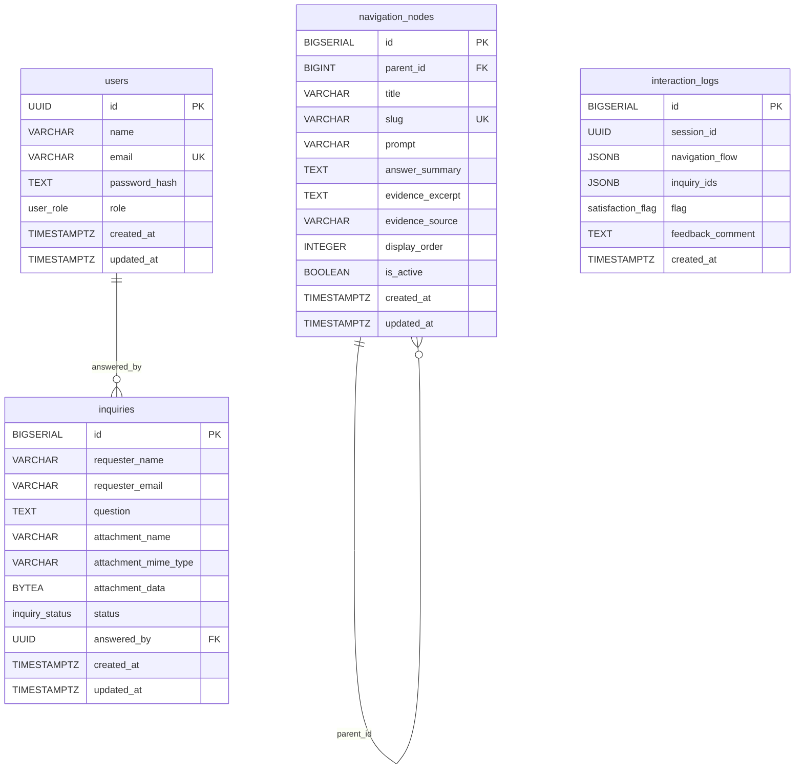

# Banco de Dados

Scripts SQL de inicialização do PostgreSQL usados pelo sistema Secretaria Digital.

## Responsabilidade

Esta pasta contém a estrutura relacional do banco, dados iniciais e documentação do modelo usado pela aplicação.

## Organização

```txt
backend/db/
|-- init/
|   |-- 01_schema.sql   # Estrutura do banco e compatibilização
|   |-- 02_seed.sql     # Dados iniciais
|   `-- README.md       # Documentação dos scripts de inicialização
`-- README.md           # Esta documentação
```

## Arquivos

- `init/01_schema.sql`: cria extensões, tipos, tabelas, índices, triggers e ajustes de compatibilidade.
- `init/02_seed.sql`: cria usuários iniciais e carrega a árvore de navegação do chatbot.

Detalhes de execução dos scripts em `init/`: `backend/db/init/README.md`.

## Diagrama ER



## Legenda

- `PK`: chave primária.
- `FK`: chave estrangeira.
- `UK`: chave única.
- ENUMs: `user_role`, `inquiry_status`, `satisfaction_flag`.

## Campos Relevantes

### `users`

- `name`: nome exibido do usuário interno.
- `email`: login único do usuário.
- `password_hash`: senha armazenada com hash.
- `role`: perfil de acesso (`ADMIN` ou `SECRETARIA`).

### `navigation_nodes`

- `parent_id`: define a hierarquia da árvore de navegação.
- `title`: texto da opção exibida para o usuário.
- `slug`: identificador único usado nas rotas e no seed.
- `prompt`: texto de orientação exibido no fluxo.
- `answer_summary`: resposta principal apresentada ao usuário.
- `evidence_excerpt`: trecho de evidência em texto livre.
- `evidence_source`: origem da evidência, como link externo ou arquivo público.
- `display_order`: ordem de exibição dos nós no mesmo nível.
- `is_active`: controla se o nó aparece na navegação.

### `inquiries`

- `requester_name`: nome de quem enviou a dúvida.
- `requester_email`: e-mail de contato.
- `question`: dúvida enviada pelo usuário.
- `attachment_name`: nome de arquivo anexado, quando houver suporte no fluxo.
- `attachment_mime_type`: tipo MIME do anexo, quando houver suporte no fluxo.
- `attachment_data`: conteúdo binário do anexo, quando houver suporte no fluxo.
- `status`: situação da dúvida (`ABERTA` ou `RESPONDIDA`).
- `answered_by`: usuário interno que marcou a dúvida como respondida.

### `interaction_logs`

- `session_id`: identificador da sessão de atendimento.
- `navigation_flow`: sequência de opções navegadas pelo usuário.
- `inquiry_ids`: lista de dúvidas registradas na sessão.
- `flag`: avaliação de satisfação opcional (`ATENDEU` ou `NAO_ATENDEU`).
- `feedback_comment`: comentário opcional enviado pelo usuário.

## Tabelas

### `users`

Armazena usuários internos do sistema.

Campos principais:

- `name`: nome exibido do usuário.
- `email`: login único.
- `password_hash`: hash da senha.
- `role`: perfil de acesso (`ADMIN` ou `SECRETARIA`).

### `navigation_nodes`

Armazena a árvore de navegação do chatbot.

Campos principais:

- `parent_id`: nó pai, usado para montar menus e submenus.
- `title`: texto exibido para o usuário.
- `slug`: identificador único usado nas rotas.
- `prompt`: texto de orientação.
- `answer_summary`: resposta exibida ao usuário.
- `evidence_excerpt`: texto de apoio ou evidência.
- `evidence_source`: link ou fonte associada à resposta.
- `display_order`: ordem de exibição.
- `is_active`: controla se o nó aparece no atendimento.

### `inquiries`

Armazena dúvidas enviadas pelos usuários à Secretaria Acadêmica.

Campos principais:

- `requester_name`: nome de quem enviou a dúvida.
- `requester_email`: e-mail de contato.
- `question`: texto da dúvida.
- `status`: situação da dúvida (`ABERTA` ou `RESPONDIDA`).
- `answered_by`: usuário interno que marcou a dúvida como respondida.

A tabela possui campos opcionais para anexo, mas o fluxo atual do frontend/backend registra apenas nome, e-mail e texto da dúvida.

### `interaction_logs`

Armazena registros de interação do chatbot.

Campos principais:

- `session_id`: identificador da sessão.
- `navigation_flow`: sequência de opções navegadas.
- `inquiry_ids`: lista de dúvidas associadas à sessão.
- `flag`: avaliação de satisfação (`ATENDEU` ou `NAO_ATENDEU`).
- `feedback_comment`: comentário opcional do usuário.

## Índices e Integridade

O schema define:

- Chaves primárias nas tabelas principais.
- Chave única para `users.email`.
- Chave única para `navigation_nodes.slug`.
- Chave estrangeira recursiva em `navigation_nodes.parent_id`.
- Chave estrangeira de `inquiries.answered_by` para `users.id`.
- Índices para consultas por `parent_id`, `status` e `session_id`.

## Observações

- Senhas são armazenadas com hash. O seed usa `crypt(..., gen_salt('bf'))` e o cadastro via API usa `bcrypt`.
- Os scripts de `init/` são executados automaticamente no primeiro bootstrap do banco.
- Mudanças nos scripts de `init/` não são reaplicadas automaticamente em volumes já criados.
- Para reaplicar desde o início, remova o volume `postgres_data`.
- O MVP atual não possui tabelas próprias para `documents` e `document_chunks`; documentos oficiais são mantidos como arquivos estáticos no frontend e as fontes são registradas nos nós de navegação.